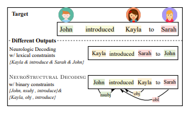

## What is NeuroStructuralDecoding?
### It is a neural text generation algorith that uses structural constraints for decoding.


This is the official page for the paper: <a href='https://aclanthology.org/2023.acl-long.528.pdf'> NEUROSTRUCTURAL DECODING: Neural Text Generation with Structural Constraints </a>  accepted at ACL2023.
 <!-- You can find our paper <a href='https://arxiv.org/abs/2205.04652'> here </a> -->

<!-- Mohaddeseh Bastan, Nishant Shankar, Mihai Surdeanu, Niranjan Balasubramanian.  -->

NEUROSTRUCTURAL DECODING is a new decoding algorithm that incorporates syntactic constraints to further improve the quality of the generated text. We build NEUROSTRUCTURAL DECODING on the NeuroLogic Decoding (Lu et al., 2021) algorithm, which enables language generation models to produce fluent text while satisfying complex lexical constraints. It tracks lexico-syntactic constraints  during decoding by parsing the partial generations at each step.

### Example
In the following example we see an example that compares the output produced by Neurologic Decoding with lexical constraints alone vs. the output generated by NEUROSTRUCTURAL DECODING with lexico-syntactic constraints.



### Code
Code can be in our <a href='https://github.com/StonyBrookNLP/NeuroStructuralDecoding'>. GitHub Page </a>


### Liked us? Cite us!

Please use the following bibtex entry:
```
@inproceedings{bastan-etal-2023-neurostructural,
    title = "{NEUROSTRUCTURAL} {DECODING}: Neural Text Generation with Structural Constraints",
    author = "Bastan, Mohaddeseh  and
      Surdeanu, Mihai  and
      Balasubramanian, Niranjan",
    editor = "Rogers, Anna  and
      Boyd-Graber, Jordan  and
      Okazaki, Naoaki",
    booktitle = "Proceedings of the 61st Annual Meeting of the Association for Computational Linguistics (Volume 1: Long Papers)",
    month = jul,
    year = "2023",
    address = "Toronto, Canada",
    publisher = "Association for Computational Linguistics",
    url = "https://aclanthology.org/2023.acl-long.528",
    doi = "10.18653/v1/2023.acl-long.528",
    pages = "9496--9510",
}
```

